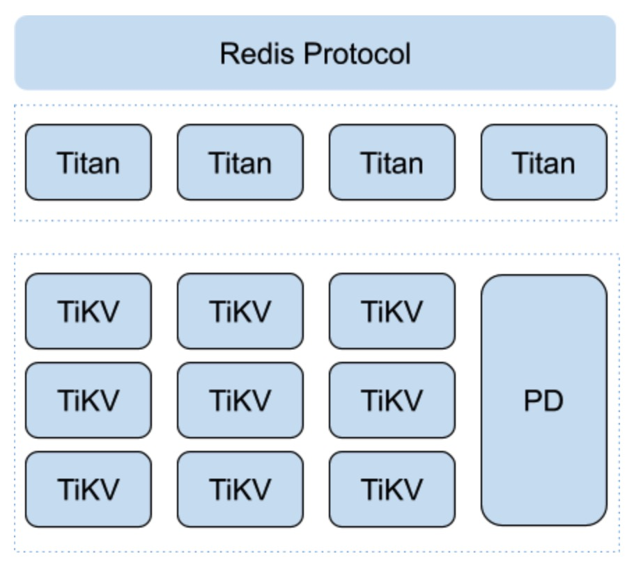

# Titan

[](https://travis-ci.org/distributedio/titan)
[](https://goreportcard.com/report/github.com/distributedio/titan)
[](https://coveralls.io/github/distributedio/titan?branch=master)
[](https://github.com/distributedio/titan/releases)
[](https://titan-tech-group.slack.com)

A distributed implementation of __Redis compatible layer__  based on [TiKV](https://github.com/tikv/tikv/)

## Why Titan?
* Completely compatible with redis protocol
* Full distributed transaction with strong consistency
* Multi-tenancy support
* No painful scale out
* High availability 

Thanks [TiKV](https://github.com/tikv/tikv/) for supporting the core features. The project is developed and open sourced by the Beijing Infrastructure Team at [Meitu](https://www.meitu.com/) and has been donated to [DistributedIO](https://github.com/distributedio) org.

## Architecture



## Quick start

Can't wait to experiment Titan? Just follow 2 steps:

1. curl -s -O https://raw.githubusercontent.com/distributedio/titan/master/docker-compose.yml
2. docker-compose up

Then connect to titan use redis-cli

> redis-cli -p 7369

___Enjoy!___

## Installation

### SetUp TiKV cluster
Titan works with 2 tidb components:
* TiKV
* Pd

To setup TiKV and PD, please follow official [instruction](https://pingcap.com/docs-cn/dev/how-to/deploy/orchestrated/ansible/)

### Run Titan

* Build the binary

```
go get github.com/distributedio/titan
cd $GOPATH/src/github.com/distributedio/titan
make 
```

* Edit the configration file

```
pd-addrs="tikv://your-pd-addrs:port"
```

* Run titan

```
./titan
```

For more details about [Deploy Titan](docs/ops/deploy.md), click here.

## Commands supporting status

See the details of the commands [supporting status](docs/command_list.md)

| command      | status                  |
| ------------ | ----------------------- |
| Connections  | Almost Fully Supported  |
| Transactions | Supported               |
| Server       | Almost Fully Supported  |
| Keys         | Supported               |
| Strings      | Almost Fully Supported  |
| List         | Almost Fully Supported  |
| Hashes       | Supported               |
| Sets         | Almost Fully Supported  |
| Sorted Sets  | Almost Fully Supported  |
| Geo          | Not Supported Yet       |
| Hyperloglog  | Not Supported Yet       |
| Pub/Sub      | Not Supported Yet       |
| Scripting    | Not Supported Yet       |
| Streams      | Not Supported Yet       |

## Benchmarks

Refer to the [benchmark docs](https://pan.baidu.com/s/1m5yp5LsvFjsDKvHtaXwWvg) for more details. It is shared on Baidu Disks, use the code `hzt6` to gain the permission.

Basic benchmarking result.

### Get


### Set


For more info, please vist here [Titan Benchmarks](docs/benchmark/benchmark.md)

## FAQ

[FAQ](https://github.com/distributedio/titan/issues?utf8=%E2%9C%93&q=+label%3A%22good+first+issue%22)

## Roadmap

View our [Roadmap](https://github.com/distributedio/titan/projects)
