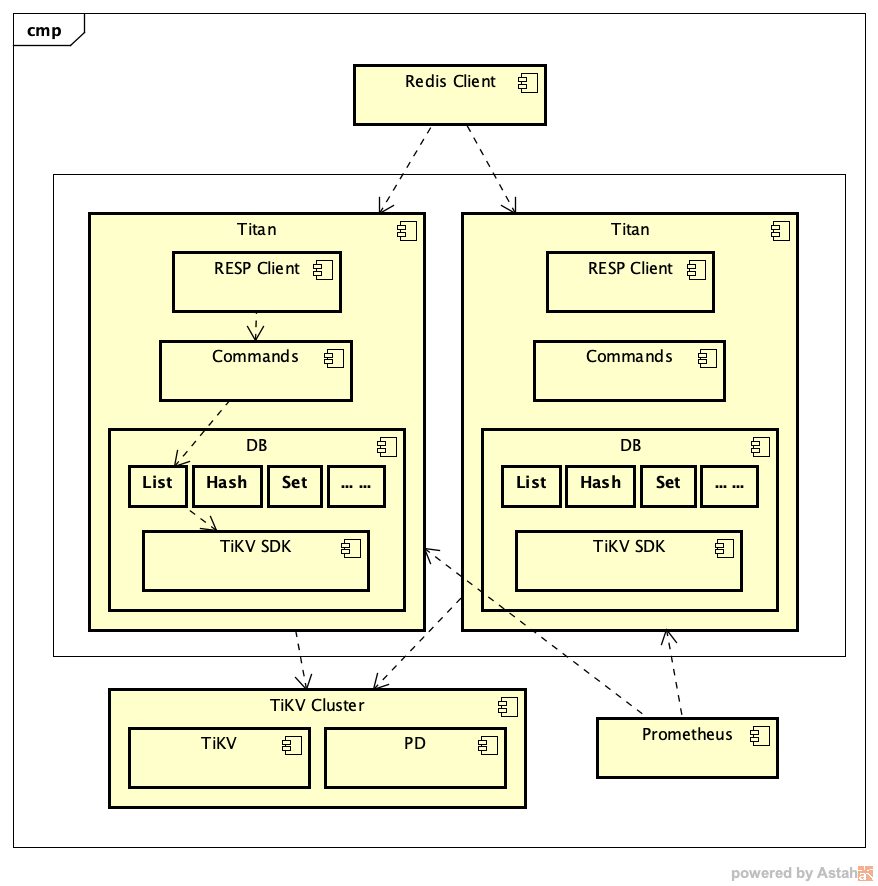
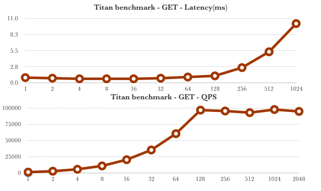
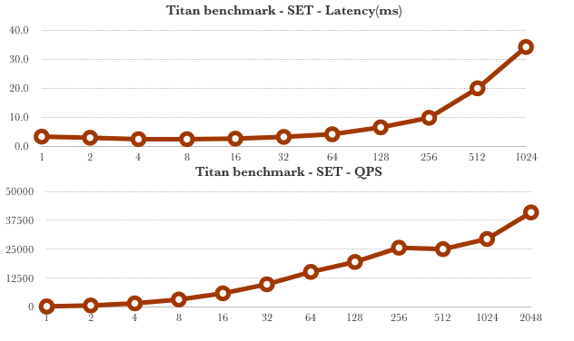

# Titan

[](https://travis-ci.org/distributedio/titan)
[](https://goreportcard.com/report/github.com/distributedio/titan)
[](https://coveralls.io/github/distributedio/titan?branch=master)
[](https://github.com/distributedio/titan/releases)
[](https://titan-tech-group.slack.com)

A distributed implementation of __Redis compatible layer__  based on [TiKV](https://github.com/tikv/tikv/)

## Why Titan?
* Completely compatible with redis protocol
* Full distributed transaction with strong consistency
* Multi-tenancy support
* No painful scale out
* High availability 

Thanks [TiKV](https://github.com/tikv/tikv/) for supporting the core features. The project is developed and open sourced by the Beijing Infrastructure Team at [Meitu](https://www.meitu.com/) and has been donated to [DistributedIO](https://github.com/distributedio) org.

## Arch

___Arch about titan___



___Arch about TiKV___


## Quick start

Can't wait to experiment Titan?

```
curl -s -O https://raw.githubusercontent.com/distributedio/titan/master/docker-compose.yml
docker-compose up

# Then connect to titan use redis-cli
redis-cli -p 7369

# Enjoy!
```

## Installation

### SetUp TiKV cluster
Titan works with 2 tidb components:
* TiKV
* Pd

To setup TiKV and PD, please follow official [instruction](https://pingcap.com/docs-cn/dev/how-to/deploy/orchestrated/ansible/)

### Run Titan

* Build the binary

```
go get github.com/distributedio/titan
cd $GOPATH/src/github.com/distributedio/titan
make 
```

* Edit the configration file

```
pd-addrs="tikv://your-pd-addrs:port"
```

* Run titan

> ./titan

[Deploy Titan](docs/ops/deploy.md)

## Benchmarks

Basic benchmarking result.

### Get



### Set



For more info, please vist here [Titan Benchmarks](docs/benchmark/benchmark.md)

## Commands not supported yet

___NOTICE: commands beyond this table has already been fully supported___

|command|type|status|
|---|---|---|
|swapdb |Connections| |
|slowlog |Server | |
|touch  |Keys | |
|unlink |Keys | |
|bitcount|Strings|| 
|bitfield|Strings||
|bitop   |Strings||
|bitpos  |Strings||
|getbit  |Strings||
|msetnx  |Strings||
|setbit  |Strings||
|setrange|Strings||
|ltrim     |List||
|lrem      |List||
|rpop      |List||
|rpoplpush |List||
|rpushhx   |List||
|blpop     |List||
|brpop     |List||
|brpoplpush|List||
|sinterstore|Sets| |
|sdiffstore |Sets| |
|srandmember|Sets| |
|sunionstore|Sets| |
|sscan      |Sets| |
|bzpopmin        |Sorted set| |
|bzpopmax        |Sorted set| |
|zcount          |Sorted set| |
|zincrby         |Sorted set| |
|zinterstore     |Sorted set| |
|zlexcount       |Sorted set| |
|zpopmax         |Sorted set| |
|zpopmin         |Sorted set| |
|zrevrank        |Sorted set| |
|zunionstore     |Sorted set| |
|zscan           |Sorted set| |
|zrangebylex     |Sorted set| |
|zrevrangebylex  |Sorted set| |
|zrangebyscore   |Sorted set| |
|zrank           |Sorted set| |
|zremrangebylex  |Sorted set| |
|zremrangebyrank |Sorted set| |
|zremrangebyscore|Sorted set| |
|zrevrangebyscore|Sorted set| |
|geoadd           |Geo| |
|geohash          |Geo| |
|geopos           |Geo| |
|geodist          |Geo| |
|georadius        |Geo| |
|georadiusbymember|Geo| |
|pfadd  |Hyperhyperlog| |
|pfcount|Hyperhyperlog| |
|pfmerge|Hyperhyperlog| |
|psubscribe  |Pub/Sub| |
|pubsub      |Pub/Sub| |
|publish     |Pub/Sub| |
|punsubscribe|Pub/Sub| |
|subscribe   |Pub/Sub| |
|unsubscribe |Pub/Sub| |
|eval         |Script| |
|evalsha      |Script| |
|script debug |Script| |
|script flush |Script| |
|script kill  |Script| |
|script load  |Script| |
|script exists|Script| |
|xadd      |Stream| |
|xrange    |Stream| |
|xrevrange |Stream| |
|xlen      |Stream| |
|xread     |Stream| |
|xpending  |Stream| |
|xreadgroup|Stream| |

## FAQ

[FAQ](https://github.com/distributedio/titan/issues?utf8=%E2%9C%93&q=+label%3A%22good+first+issue%22)

## Roadmap
### Sprint #8
* Aim 1
* Aim 2
* Aim 3

[Roadmap](docs/roadmap.md)

