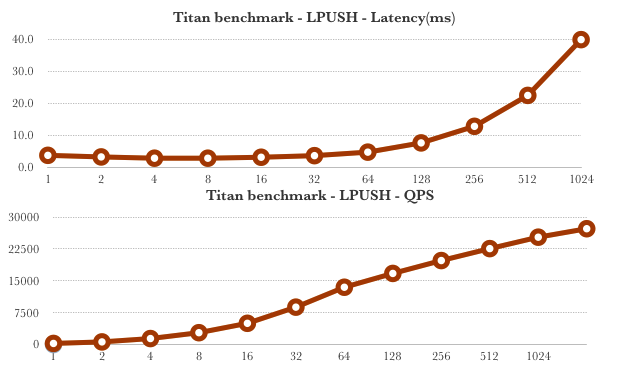
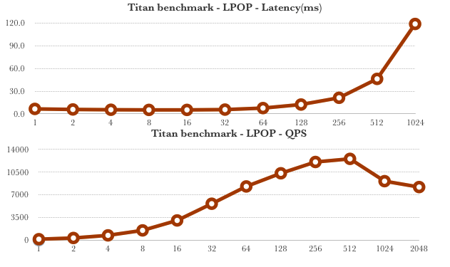

# Benchmark of titan

## Environment

```
Titan Cluster(HDD sata)
192.168.134.48 (CPU：Intel(R) Xeon(R) CPU E5-2630 v3 @ 2.40GHz,  Mem：32G)
192.168.134.70 (CPU: Intel(R) Xeon(R) CPU E5-2630 v3 @ 2.40GHz, Mem: 32G)

TiKV Cluster (SSD sata, 4 TiKV instance on one physical machine)
192.168.135.41:20171 (CPU: Intel(R) Xeon(R) CPU E5-2630 v4 @ 2.20GHz, Mem: 96G, Disk: 5*480G)
192.168.135.41:20172
192.168.135.41:20174
192.168.135.41:20173

192.168.135.54:20171
192.168.135.54:20172
192.168.135.54:20173
192.168.135.54:20174

192.168.133.114:20171
192.168.133.114:20172
192.168.133.114:20173
192.168.133.114:20174

pd (SSD sata)
192.168.135.41:2379
192.168.135.54:2379
192.168.133.114:2379

TiKV tunning
[server]
grpc-concurrency = 8

[raftstore]
sync-log = false


[rocksdb.defaultcf]
block-cache-size = "9.6GB"

[rocksdb.writecf]
block-cache-size = “3.6GB”
```

Fill into 500G first before benchmarking

## Results

### Get


### Set


### LPush



### LPop



### LRange


